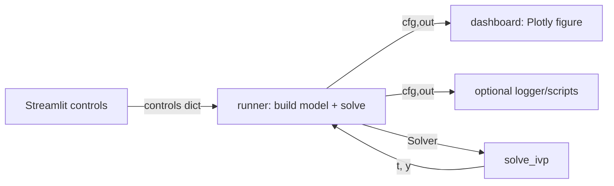

# Overview

DSS (“Dynamic System Simulator”) is organized around a small, consistent core:

- **System**: an object exposing a `dynamics(t, state, u=None)` method returning the state derivative.
- **Solver**: a thin wrapper over `scipy.integrate.solve_ivp` that builds a time grid and integrates the system.
- **Streamlit GUI**: a “SystemSpec” registry that binds UI controls → simulation run → a Plotly dashboard.

The design goal is to make it easy to:
- change physical parameters,
- run controlled experiments (time series, phase portraits, energy drift),
- compare numerical settings (tolerances, methods, sampling),
- add new systems without rewriting the GUI plumbing.

## High-level architecture

## Naming conventions

- `T` – total simulation duration [s]
- `fps` – sampling frequency used to build `t_eval` (not an integrator step size)
- `dt` – GUI step/sampling interval (typically `dt = 1/fps`)
- `state` – numpy array of model states (see `docs/models.md` for each system)

## Where things live

- `dss/models/` – physics/equations of motion + helper methods like `state_labels()`
- `dss/core/solver.py` – integration wrapper
- `dss/core/experiments.py` – helper that measures runtime and basic diagnostics
- `dss/core/logger.py` – JSONL run logger (metadata + solver config + diagnostics)
- `dss/controllers/` – LQR + swing-up logic (used primarily with inverted pendulum)
- `dss/wrappers/` – wrappers that compose systems (e.g., motor + plant)
- `apps/streamlit/` – interactive GUI: registry, per-system views, per-system dashboards, animations, plot helpers
